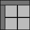
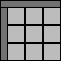
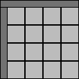

Corner tiles
============

Smooth edge corner tiles designed to be compatible with Dwarven Forge dungeon tiles.

I've created the smooth set as a way of designing the basic form of the tiles that I intend for all other sets.  These tiles can be used as concrete, ice, dirt, or painted to really be any type of tile, as they have no printed decoration.

This set has been upgraded to [OpenForge 2.0](https://github.com/devonjones/OpenForge).

Smooth
------

<table>
<tr>
  <td></td>
</tr>
<tr>
  <td></td>
</tr>
<tr>
  <td></td>
</tr>
<tr>
  <td></td>
</tr>
</table>

You can find this set on [thingivese](http://www.thingiverse.com/thing:234759)
