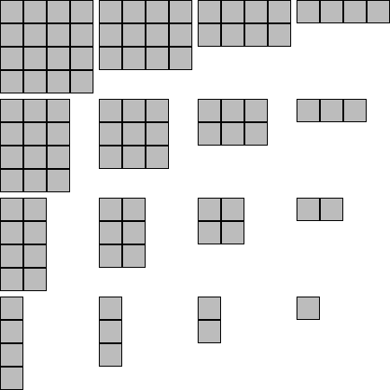

Floor tiles
===========

Dungeon floor tiles designed to be compatible with Dwarven Forge dungeon tiles.

I've created the smooth set as a way of designing the basic form of the tiles that I intend for all other sets.  These tiles can be used as concrete, dirt, ice, or painted to really be any type of tile, as they have no printed decoration.

Smooth
------

Currently there are 16 smooth floor tiles in every size from 1x1 to 4x4.

<map name="image-maps-2015-02-03-220206" id="ImageMapsCom-image-maps-2015-02-03-220206">

<area  alt="4x4 Smooth Floor Tile" title="4x4 Smooth Floor Tile" href="smooth_floor_4x4.stl" shape="rect" coords="0,0,108,108" style="outline:none;" target="_self" />
<area  alt="4x3 Smooth Floor Tile" title="4x3 Smooth Floor Tile" href="smooth_floor_4x3.stl" shape="rect" coords="109,0,217,108" style="outline:none;" target="_self" />
<area  alt="4x2 Smooth Floor Tile" title="4x2 Smooth Floor Tile" href="smooth_floor_4x2.stl" shape="rect" coords="218,0,324,108" style="outline:none;" target="_self" />
<area  alt="4x1 Smooth Floor Tile" title="4x1 Smooth Floor Tile" href="smooth_floor_4x1.stl" shape="rect" coords="325,0,434,108" style="outline:none;" target="_self" />

<area  alt="3x4 Smooth Floor Tile" title="3x4 Smooth Floor Tile" href="smooth_floor_3x4.stl" shape="rect" coords="0,109,108,217" style="outline:none;" target="_self" />
<area  alt="3x3 Smooth Floor Tile" title="3x3 Smooth Floor Tile" href="smooth_floor_3x3.stl" shape="rect" coords="109,109,217,217" style="outline:none;" target="_self" />
<area  alt="3x2 Smooth Floor Tile" title="3x2 Smooth Floor Tile" href="smooth_floor_3x2.stl" shape="rect" coords="218,109,324,217" style="outline:none;" target="_self" />
<area  alt="3x1 Smooth Floor Tile" title="3x1 Smooth Floor Tile" href="smooth_floor_3x1.stl" shape="rect" coords="325,109,434,217" style="outline:none;" target="_self" />

<area  alt="2x4 Smooth Floor Tile" title="2x4 Smooth Floor Tile" href="smooth_floor_2x4.stl" shape="rect" coords="0,218,108,324" style="outline:none;" target="_self" />
<area  alt="2x3 Smooth Floor Tile" title="2x3 Smooth Floor Tile" href="smooth_floor_2x3.stl" shape="rect" coords="109,218,217,324" style="outline:none;" target="_self" />
<area  alt="2x2 Smooth Floor Tile" title="2x2 Smooth Floor Tile" href="smooth_floor_2x2.stl" shape="rect" coords="218,218,324,324" style="outline:none;" target="_self" />
<area  alt="2x1 Smooth Floor Tile" title="2x1 Smooth Floor Tile" href="smooth_floor_2x1.stl" shape="rect" coords="325,218,434,324" style="outline:none;" target="_self" />

<area  alt="1x4 Smooth Floor Tile" title="1x4 Smooth Floor Tile" href="smooth_floor_1x4.stl" shape="rect" coords="0,325,108,434" style="outline:none;" target="_self" />
<area  alt="1x3 Smooth Floor Tile" title="1x3 Smooth Floor Tile" href="smooth_floor_1x3.stl" shape="rect" coords="109,325,217,434" style="outline:none;" target="_self" />
<area  alt="1x2 Smooth Floor Tile" title="1x2 Smooth Floor Tile" href="smooth_floor_1x2.stl" shape="rect" coords="218,325,324,434" style="outline:none;" target="_self" />
<area  alt="1x1 Smooth Floor Tile" title="1x1 Smooth Floor Tile" href="smooth_floor_1x1.stl" shape="rect" coords="325,325,434,434" style="outline:none;" target="_self" />

</map>

You can find this set on [thingivese](http://www.thingiverse.com/thing:234325)
